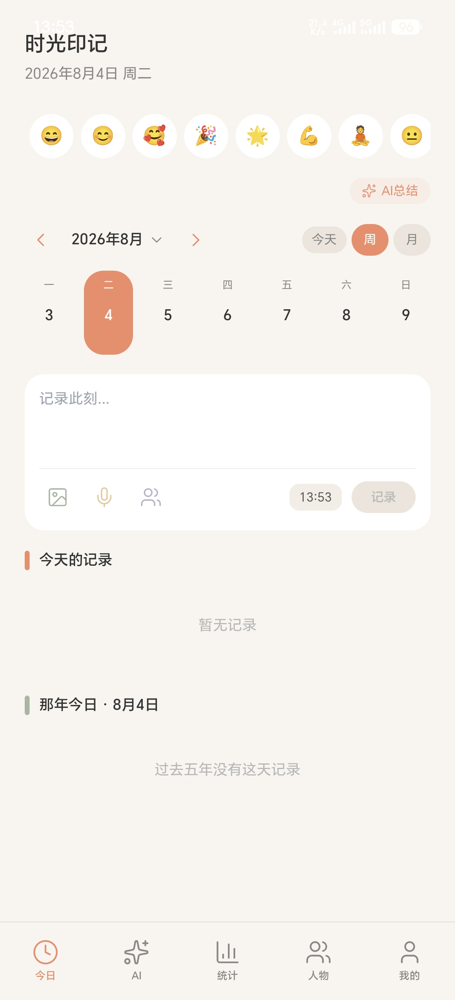
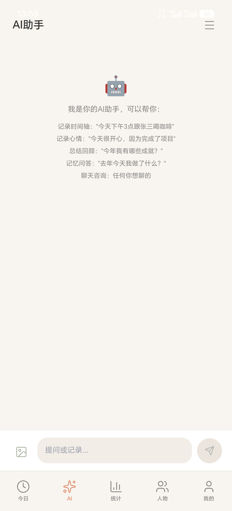
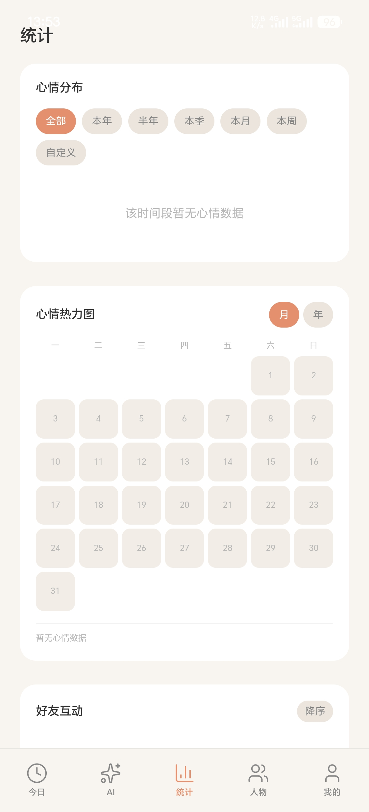
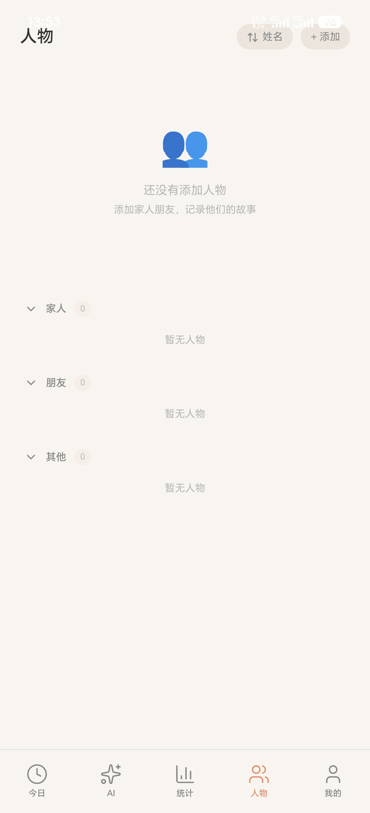

# 时光印记（ShiGuang YinJi）

我的 Android 混合应用作品（简历项目）——基于腾讯 App 生成器 + Capacitor 构建，Kotlin 原生壳包装 Web 前端。

> 安装包在右侧 [Releases](https://github.com/l-umos/shiguang-yinji/releases) 中下载。

## 应用截图






## 应用简介

「时光印记」是一站式生活记录与成长陪伴应用，包含五年计划、统计看板、角色管理、情绪管理、AI 助手等模块。

## 功能页面

| 路由 | 页面 |
| --- | --- |
| `/` | 首页 |
| `/five-year` | 五年计划 |
| `/stats` | 统计看板 |
| `/characters` | 角色管理 |
| `/profile` | 个人中心 |
| `/mood-manage` | 情绪管理 |
| `/ai` | AI 助手 |
| `/ai-prefs` | AI 偏好设置 |
| `/settings` | 设置 |

## 安装方法

1. 在手机浏览器打开 [Releases](https://github.com/l-umos/shiguang-yinji/releases) 下载 `shiguang-yinji.apk`
2. 在手机设置中允许「安装未知来源应用」
3. 打开 APK 安装

> ⚠️ 如果安装提示「安装包有问题」：请**直接从 GitHub 下载**，不要用微信等聊天工具转发 APK——聊天工具转发容易损坏文件或触发安装拦截。仓库里上传的是原始 APK（与原文件字节一致，SHA-256 相同），自带 v2/v3 签名。

## 文件校验

`shiguang-yinji.apk` SHA-256：

```
B614AA80012A022ED3310A5CAE90CF5F08E66A5EBB6DF80E01ABD252151BD391
```

## 拆包代码（apk-extracted/）

本仓库同时提供 APK 的拆包内容，便于自行调试：

```
apk-extracted/
├── assets/               # H5 前端代码（Angular/Vite 产物，主要调试对象）
│   └── public/           #   含 index.html、routes.json、JS bundle
├── AndroidManifest.xml   # 应用清单（包名、权限、组件）
├── resources.arsc        # 编译后的资源表
├── classes.dex           # 原生代码字节码（可用 jadx 反编译查看）
└── APK-STRUCTURE.md      # 结构说明
```

调试建议：改前端逻辑直接编辑 `assets/public/` 下的代码并重新打包；想看原生层逻辑用 [jadx](https://github.com/skylot/jadx) 反编译 `classes.dex`。

## 技术栈

- **Capacitor**：Android 混合应用壳
- **Kotlin / Java**：原生层（MainActivity / MainApplication）
- **WebView + H5**：Angular / Vite 构建产物
- **OkHttp**：网络请求层
- **PictureSelector**：图片选择与处理
- **腾讯 Aegis**：前端可观测性 SDK

## 构建说明

本应用使用腾讯「App 生成器」配置并导出，H5 运行时与部分 SDK 由腾讯提供；应用图标、页面配置、打包与发布由我完成。应用名「时光印记」，包名 `yyb.ai.y178577885095228c7d41ba89399cd`，版本 1.0（versionCode 3），minSdk 23 / targetSdk 35。

## 后续计划

- 将核心页面重构为自研前端 / 原生组件
- 接入自建后端与真实 AI 服务
- 修复图标资源命名，提供可复用构建脚本
